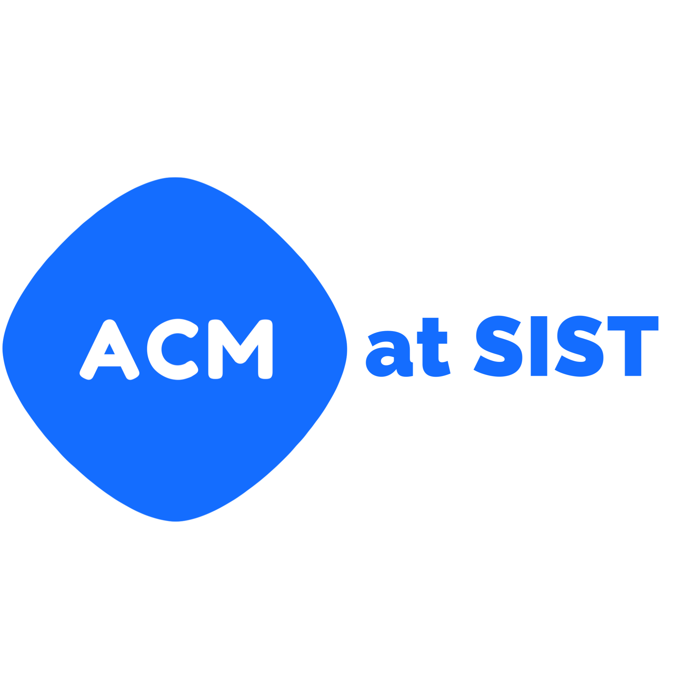

<h1 align="center">
  <br />
  ACM-SIST Backend
</h1>

<p align="center">This is the backend for ACM-SIST (Sathyabama Institute of Science and Technology) Student Chapter Club</p>

## Features
- `/users` -> Create User, Login User, Verify User, Send Verify Mail (for resend), Forgot Password, Reset Password [U] and Current User [U]
- `/members` -> Create Member, Login Member, Update Member [M], Search Member, Reset Password [M] and Current Member [M]
- `/events` -> Create Event [M], Update Event [M], Delete Event [M], Search Event, Register Event [M], My Events [U], Pending Verification [M]
- `/payment_proof` -> Upload Payment Screenshot and Get Payment Screenshot [M]
- `/blogs` -> Create Blog [M], Update Blog [M], Delete Blog [M] and Get Blogs
- `/achievements` -> Get Number of Users, Members and Events
- `/export` ->  Get data from database [M]
- `/favicon.ico` -> In case if a browser request `/favicon.ico` to show Favicon Icon (Happens when the user clicks the verification link sent on email)

[U] -> User Login Required <br />
[M] -> Member Login Required

## TODO
- [ ] Write Tests for all API endpoints
- [ ] API Documentation

## Instructions to Setup the Server

Required: <b>Python >= 3.10</b>

### Download Python
Download From <a href="https://www.python.org">Python Official Website</a>

#### CLI Installation of Python
```bash
# Arch Linux
sudo pacman -S python
sudo pacman -S python-pip
# If you are not using arch please refer your OS package manager to install 

# Mac
brew install python
```

### Get the code
```bash
git clone https://github.com/kishor1445/ACM_SIST_Backend.git
cd ACM_SIST_Backend
```

### Local Machine
<b>NOTE</b>: If you are gonna run the server locally on your system then it is recommended to setup the virtual environment
```bash
# Create Virtual Environment
python3.12 -m venv .venv

# Activate Virtual Environment
# Windows
.\.venv\Scripts\activate

# Linux/Mac
source .venv/bin/activate
```

### Install Requirements
```bash
pip install -r requirements.txt
```
If you get an error like command not found or pip is not a recognized command then try `pip3`. If you still get an error then it means pip is not installed or it is not added to PATH. Please search on the internet to fix that problem

If you are testing/developing the server then install `requirements-dev.txt` as well

### Configuration
Create the file called `.env` in the root directory of the project and set the values for the below environment variables
```plaintext
MAIL_USER=<EMAIL_ID>
MAIL_PASS=<EMAIL_PASSWORD>
SECRET_KEY=<YOUR_SECRET_KEY>
JWT_ALGORITHM=HS256
ACCESS_TOKEN_EXPIRE_DAYS=2
ACM_SIST_CHAIR=<NAME>
```
<b>NOTE</b>: <EMAIL_PASSWORD> is the App Password. Please refer this [link](https://support.google.com/accounts/answer/185833?hl=en) to create App Password

### Run the server
```bash
uvicorn app.main:app
```

## License

This project is licensed under the MIT License - see the [LICENSE](https://github.com/kishor1445/ACM_SIST_Backend/blob/v2/LICENSE) file for more details.
